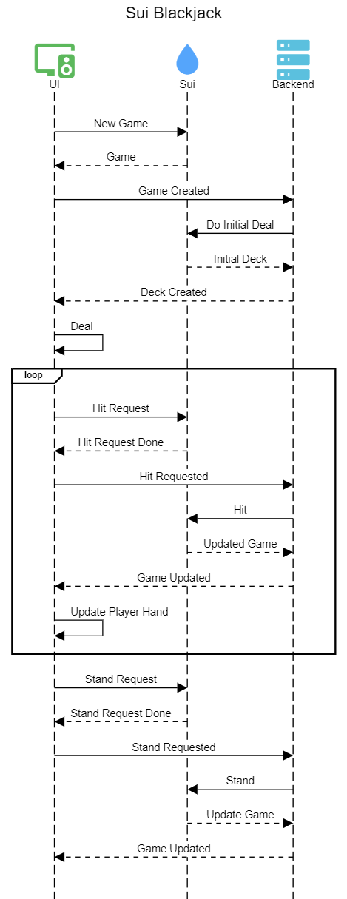

# Sui Blockjack Game

## Overview
Sui Blockjack is a decentralized card game built on the Sui blockchain. It combines the classic Blackjack gameplay with the power of blockchain technology, ensuring transparency, fairness, and immutability. Players can interact with the game using their crypto wallets and enjoy a seamless gaming experience.

## Sui Blockjack Modules

### `single_player_blackjack.move`

Defines the game object and provides methods to create and play a game. The overall flow is:

- **Admin** (owner of the HouseCap object) invokes `initialize_house_data` (one-time setup).
- **Player** invokes `place_bet_and_create_game` to start a new game with randomness and a bet.
- **Dealer** invokes `first_deal` to perform the initial deal.
- **Player** invokes `do_hit` to request a hit (minting and transferring a `HitRequest`).
- **Dealer** invokes `hit` to process the hit action.
- **Player** invokes `do_stand` to request a stand (minting and transferring a `StandRequest`).
- **Dealer** invokes `stand` to process the stand action.

### `counter_nft.move`

Defines the Counter NFT object, used as a unique VRF input for every game. Players must create a Counter NFT before their first game. The UI can automate this during game creation.

## Quickstart

1. Navigate to the setup directory: `cd setup/`
2. Install dependencies: `npm i`
3. Set up environment variables as described in `setup/README.md`
4. Deploy contracts: `./publish.sh testnet`
5. Initialize house data: `npm run init-house` (admin account needs at least 10 SUI + gas)
6. Go to the app directory: `cd ../app/`
7. Install frontend dependencies: `pnpm i`
8. Start the development server: `pnpm run dev`

## Gameplay

- 1-1 game: player vs. dealer (machine).
- Dealer has a public BLS key.
- Player generates randomness, places bet, and starts the game.
- Dealer backend signs and executes the initial deal.
- Player can _Hit_ or _Stand_:
    - _Stand_: Dealer draws until reaching >= 17, then compares sums to declare the winner.
    - _Hit_: Dealer draws a card for the player.
- Each action (Deal, Hit, Stand) involves two transactions: one from the player (intent), one from the dealer (execution).

**Stake is fixed at 0.2 SUI**

## Game Flow

The sequence diagram below illustrates the game flow:



### Source Code Directory Structure

- `move/`: Move smart contracts (`blackjack` package)
- `app/`: Frontend (React.js, Next.js, Tailwind CSS)
- `setup/`: Typescript project for environment setup, Sui SDK integration, and deployment scripts

```
Sui-blockjack/
├── contracts/          # Smart contracts written in Move
├── frontend/           # Frontend application (React/Next.js)
├── scripts/            # Deployment and utility scripts
├── tests/              # Unit and integration tests
├── README.md           # Project documentation
└── package.json        # Project dependencies and scripts
```

## How to Start the Game
1. **Clone the Repository**  
    ```bash
    git clone https://github.com/lorine93s/Sui-blockjack.git
    cd sui-blockjack
    ```

2. **Install Dependencies**  
    ```bash
    npm install
    ```

3. **Deploy Smart Contracts**  
    Ensure you have the Sui CLI installed and configured. Then, deploy the contracts:  
    ```bash
    sui move publish 
    ```

4. **Run the Frontend**  
    Start the frontend application:  
    ```bash
    npm run dev
    ```

5. **Play the Game**  
    Open your browser and navigate to `http://localhost:3000`. Connect your wallet and start playing!

## Features
- Decentralized gameplay powered by Sui blockchain.
- Transparent and fair card dealing.
- Wallet integration for seamless transactions.
- Leaderboard to track top players.

## Prerequisites
- Node.js and npm installed.
- Sui CLI installed and configured.
- A Sui-compatible wallet (e.g., Sui Wallet).

## Contributing
Contributions are welcome! Please fork the repository, make your changes, and submit a pull request.

## License
This project is licensed under the MIT License. See the `LICENSE` file for details.
## Author
Kien Lam
